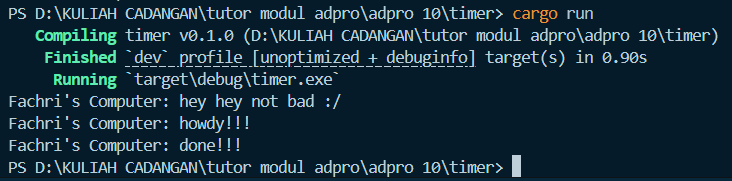
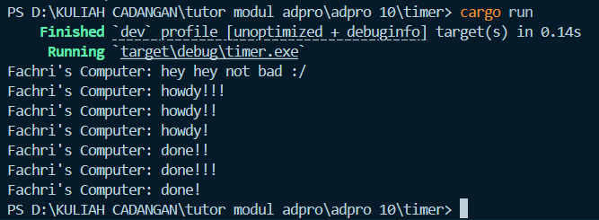
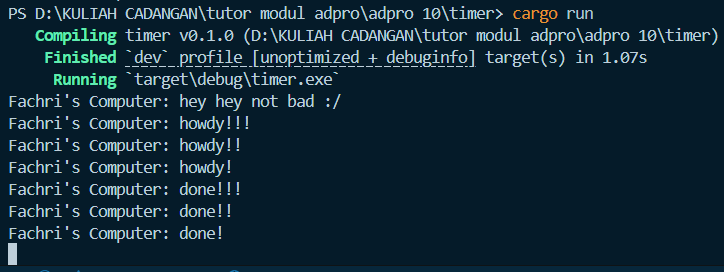

# Advprog Module 10 Tutorial Part 1 - Timer
Hadyan Fachri\
2306245030\
Advprog A

## Reflection
**Add such a sentence (you need to modify the text) right after the spawner.spawn (...);  
Take a look at what happened. Capture the result of your execution. 
Put it in your Readme.md, with some explanation why the result is as such.**


Setelah saya menambahkan pesan setelah spawner, terlihat bahwa pesan `Fachri's Computer: hey hey not bad :/` muncul terlebih dahulu. Ini karena pesan tersebut dieksekusi langsung di fungsi `main`, sebelum `executor.run()` dijalankan.

Future yang berisi `howdy!!!` dan `done!!!` hanya mulai dijalankan saat `executor.run()` dipanggil. `howdy!!!` dieksekusi lebih dulu saat task pertama kali diproses. Kemudian, karena ada `await Timer::new(...)`, task akan tertunda (Pending) selama **2 detik**. Setelah waktu habis, executor melanjutkan task tersebut dan mencetak `done!!!`.


Setelah saya menambahkan dua pesan baru untuk mengetes multiple spawn, ada hal menarik disini. Jika memperhatikan pada gambar, pesan
```
Fachri's Computer: howdy!!!
Fachri's Computer: howdy!!
Fachri's Computer: howdy!
```
saya perhatikan bahwa semua pesan howdy muncul berurutan sesuai urutan spawn. Namun, pesan
```
Fachri's Computer: done!!
Fachri's Computer: done!!!
Fachri's Computer: done!
```
muncul **tidak berurutan** setelah 2 detik. Kenapa tidak berurutan? Ini terjadi karena semua task menunggu (`await`) timer yang berdurasi sama (2 detik), dan begitu waktunya habis, task dibangunkan secara bersamaan oleh mekanisme async timer. 

Namun, **urutan task dibangunkan dan diproses oleh executor bisa berbeda-beda karena sifat konkurensi dan antrean task** yang tidak menjamin urutan tetap. Akibatnya, output `done!`, `done!!`, dan `done!!!` muncul dalam urutan yang tidak selalu sama dengan urutan spawn.


Saat saya menghilangkan perintah `drop(spawner)`, terlihat jelas pada gambar bahwa program tidak mau berhenti setelah menyelesaikan task terakhir yaitu memunculkan pesan `done!`, `done!!`, dan `done!!!` secara berurutan setelah 2 detik. Jadi peran `drop(spawner)` cukup penting pada implementasi spawner karena untuk membuat titik dimana program dihentikan pada waktu yang sudah diatur.